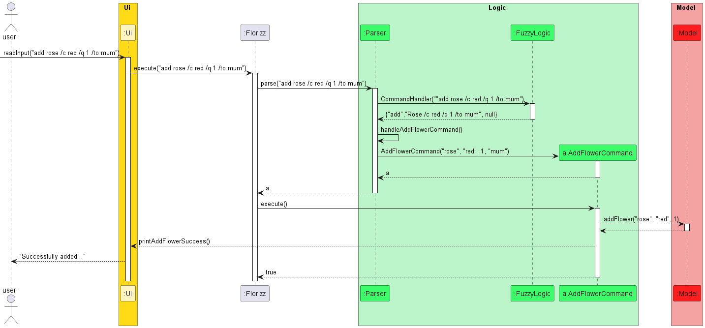
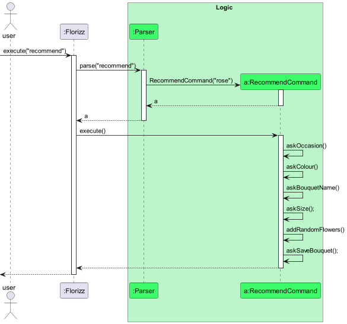
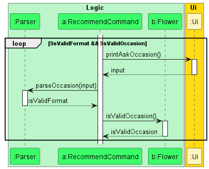

# Ian Freda Hariyanto - Project Portfolio Page

## Overview
Florizz is a digital florist replacement that helps users choose appropriate
flowers to put into a bouquet for various occasions.

## Summary of Contributions
### Code Contributed
Click [here](https://nus-cs2113-ay2324s2.github.io/tp-dashboard/?search=ianfh&sort=groupTitle&sortWithin=title&timeframe=commit&mergegroup=&groupSelect=groupByRepos&breakdown=true&checkedFileTypes=docs~functional-code~test-code~other&since=2024-02-23&tabOpen=true&tabType=authorship&tabAuthor=IanFH&tabRepo=AY2324S2-CS2113-T11-3%2Ftp%5Bmaster%5D&authorshipIsMergeGroup=false&authorshipFileTypes=docs~functional-code~test-code~other&authorshipIsBinaryFileTypeChecked=false&authorshipIsIgnoredFilesChecked=false) to view my contributions.

### Enhancements Implemented
* **New Feature**: Add Flower Command
    * Command takes in the format `add <flowerName> /q <quantity> /to <bouquetName>`. This command was necessary to
      allow users to create bouquets with flowers of their choosing, and was a key feature of the programme.
    * The command was implemented by creating a new class `AddFlowerCommand` which would take in the user input and
      parse it to identify the flower, quantity and bouquet name. The command would then add the flower to the bouquet
      and update the bouquet accordingly.

* **New Feature**: Remove Flower Command
    * Command takes in the format `remove <flowerName> /q <quantity> /from <bouquetName>`. This command was necessary to
      allow users to remove flowers from their bouquets, and was a key feature of the programme.
    * The command was implemented by creating a new class `RemoveFlowerCommand` which would take in the user input and
      parse it to identify the flower, quantity and bouquet name. The command would then remove the flower from the bouquet
      and update the bouquet accordingly.

* **New Feature**: Recommend Command
  * Command takes in the format `recommend` which will enter the user into 'recommend mode'. In this mode, the user can
    input the occasion, colour, name, and size of the bouquet and the programme will recommend a bouquet for them.
  * The command matches the user requirements with the flowers in `FlowerDictionary` and creates a bouquet containing some main flowers and some filler flowers.
  * This command was necessary to allow beginner users who are not familiar with flowers to get a bouquet recommendation
    based on the occasion they are looking for.

* **New Feature**: Bye Command
  * Command takes in the format `bye` which will exit the programme. This command was necessary to allow users to exit
    the programme when they are done using it.

* **Enhancements**: Added Regex for Parsing User Input
    * The first to suggest and implemented regex for parsing user input for `add` and `remove` command. This was necessary to ensure that the user input was
      correctly parsed and the correct flower, quantity and bouquet name was identified. [proof](https://github.com/nus-cs2113-AY2324S2/tp/commit/34889baaa7a024c6c8f1fef686b7ebe4493d9f44#diff-bb1b61dd1311729e01e01d2e43ccaf1648d0e8a57a97f5eafc82c1add885d247)
  
* **Enhancements**: Added More Flowers to `FlowerDictionary`
    * Researched main flowers and filler flowers that are available in Singapore along with their prices [proof](https://github.com/AY2324S2-CS2113-T11-3/tp/pull/97/files)

* **Unused** : Configured sqlite3 database for storage of flowers and bouquets. 
    * This was not used in the final product as we found out DBMS was not allowed for this project. [proof](https://github.com/AY2324S2-CS2113-T11-3/tp/pull/92)

### Contributions to the UG
- Added Table of Contents to the UG [proof](https://github.com/AY2324S2-CS2113-T11-3/tp/pull/178/files)
- Added the add flower command to the UG [proof](https://github.com/AY2324S2-CS2113-T11-3/tp/pull/42/files)
- Added the remove flower command to the UG [proof](https://github.com/AY2324S2-CS2113-T11-3/tp/pull/42/files)
- Added the recommend command to the UG [proof](https://github.com/AY2324S2-CS2113-T11-3/tp/pull/178/files)
- Added the bye command to the UG [proof](https://github.com/AY2324S2-CS2113-T11-3/tp/pull/42/files)

### Contributions to the DG
- Responsible for the add flower command sequence diagram and descriptions [proof](https://github.com/AY2324S2-CS2113-T11-3/tp/pull/78/files)
- Responsible for proposed storage implementation and storage class diagram for DG draft [proof](https://github.com/AY2324S2-CS2113-T11-3/tp/pull/78/files)
- Responsible for recommend command sequence diagram and descriptions [proof](https://github.com/AY2324S2-CS2113-T11-3/tp/pull/178/files)
- Responsible for askOccasion sequence diagram and description [proof](https://github.com/AY2324S2-CS2113-T11-3/tp/pull/178/files)
- Responsible for Appendix of product scope, value proposition, user stories, and use cases [proof](https://github.com/AY2324S2-CS2113-T11-3/tp/pull/72/files)
- Updated info command, remove flower command sequence diagram based on TA's feedback [proof](https://github.com/AY2324S2-CS2113-T11-3/tp/pull/169/files)

#### Diagram Added

### Contributions to Team-based Tasks
- Helped to set up the issue tracker for the team (i.e. milestones, tagging)

### Review/mentoring Contributions
- Reviewed and provided feedback on PRs by other team members [proof](https://nus-cs2113-ay2324s2.github.io/dashboards/contents/tp-comments.html#19-ian-anto-ianfh-31-comments)